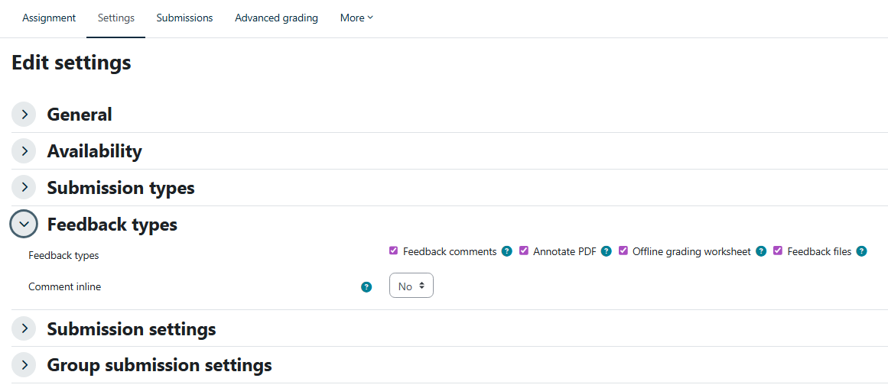

# pevaluate

`pevaluate` helps grade Moodle submissions with an LLM. It can unpack Moodle downloads, extract nested student zips, convert notebooks to Markdown, prefer notebooks over exported HTML, clean noisy HTML artifacts, save structured feedback as YAML, and compile that feedback back into a Moodle marks CSV.

The package installs as `pevaluate`. The older `autocorrect` command is still available as a CLI alias.

## Installation

Install the package in editable mode from this repository:

```bash
pip install -e .
```

Create a `.env` file with your OpenRouter API key:

```env
OPENROUTER_API_KEY=your_api_key_here
```

## Moodle Setup

For Moodle upload/download workflows, enable the feedback tools in the assignment settings:

1. Open the assignment settings.
2. Under **Feedback types**, enable **Feedback files** and **Offline grading worksheet**.



3. Download the Moodle submissions zip and, later, download the grading worksheet or marks CSV.

You do not need to unzip the Moodle submissions zip manually. The simplest workflow is to put the downloaded zip in the session folder and let `pevaluate` unpack it.

If you already unzipped the Moodle download yourself, use `--no-unzip --students-dir path/to/submissions`.

## Session Folder

A representative session folder looks like this:

```text
my_assignment/
  moodle_submissions.zip
  rubric.txt
  example.txt
  marks.csv
```

`marks.csv` is only needed when compiling feedback back into a Moodle upload CSV. If student submissions contain their own zip files, add `--extract-nested-zips`.

## Representative Workflow

First run a dry pass. This unpacks submissions, extracts nested zips, converts notebooks for inspection, and does not call the LLM:

```bash
pevaluate "my_assignment" \
  --extract-nested-zips \
  --no-grade \
  --no-reference \
  --files-regex ".*\.(ipynb|html)$" \
  --prefer-extensions ".ipynb;.html"
```

After checking the generated files, run grading without unpacking/converting again:

```bash
pevaluate "my_assignment" \
  --no-unzip \
  --no-convert \
  --no-reference \
  --rubric rubric.txt \
  --example example.txt \
  --files-regex ".*\.(ipynb|html)$" \
  --prefer-extensions ".ipynb;.html" \
  --keep-prompt \
  --model "google/gemini-3.1-pro-preview"
```

For an already unzipped Moodle download:

```bash
pevaluate "my_assignment" \
  --no-unzip \
  --students-dir "my_assignment/submissions" \
  --extract-nested-zips \
  --no-reference \
  --files-regex ".*\.(ipynb|html)$" \
  --prefer-extensions ".ipynb;.html"
```

By default, if both `.ipynb` and `.html` exist for the same submission, `pevaluate` grades the `.ipynb` and reports the skipped `.html`. HTML artifacts are cleaned from `.ipynb`, `.md`, and `.html` content before prompting. Disable this only when those artifacts are relevant to grading:

```bash
pevaluate "my_assignment" --no-cleanup-html
```

`--not-cleanup-html` is accepted as an alias.

## Rubric File

The rubric should explain the grading criteria, expected output style, and any automatic benchmark or competition scores the model should consider. If feedback must name the students, include a roster in the rubric, especially for group assignments.

Example:

```text
Grade from 0 to 10. Be brief and assertive.

Notebook, 70%:
- 1.5 points: data understanding and validation.
- 3.0 points: classical model.
- 3.0 points: modern model.
- 1.0 point: experimental comparison.
- 0.5 points: error analysis and conclusions.
- 0.5 points: clarity and reproducibility.

Challenge, 30%:
Use the challenge table below. Report the team's challenge mark and combine:
final_mark = 0.70 * notebook_mark + 0.30 * challenge_mark.

Groups:
| Group | Students |
| --- | --- |
| G01 | Ana García López; Luis Pérez Soler |
| G02 | Marta Ferrer Vidal; Pablo Ruiz Mora |

Challenge results:
| Group | Rank | score | challenge_mark |
| --- | --- | --- | --- |
| G01 | 1 | 0.812 | 10.0 |
| G02 | 2 | 0.790 | 8.5 |
```

## Example Feedback File

The example file should show the tone and level of detail you want. It does not need to match the assignment exactly.

```text
Grupo G01:
- Ana García López
- Luis Pérez Soler

Notebook (70%):
0. Errores de código: 0.5/0.5.
1. Planteamiento, datos y validación: 1.25/1.5. La validación es razonable, pero faltó justificar mejor la partición.
2. Modelo clásico: 2.75/3.0. Buen resultado; faltó comparar algún hiperparámetro adicional.
3. Modelo moderno: 3.0/3.0.
4. Comparación experimental: 0.75/1.0. La tabla de resultados es clara, pero el análisis es algo superficial.
5. Análisis de errores y conclusiones: 0.25/0.5.
6. Claridad y reproducibilidad: 0.5/0.5.

Challenge (30%): posición 2/20. Nota challenge: 8.5/10.

Nota notebook: 8.75/10.
Nota final: 8.30/10.
```

## Structured Feedback YAML

Each graded submission is saved in `feedback/` as YAML. Filenames include a readable name plus a short source hash, so repeated generic filenames do not overwrite each other.

```yaml
students:
  - full_name: Ana García López
  - full_name: Luis Pérez Soler
feedback: |
  Grupo G01:
  - Ana García López
  - Luis Pérez Soler

  Notebook (70%): 8.75/10.
  Challenge (30%): 8.5/10.

  Buen trabajo. La validación es razonable y los resultados son sólidos; faltó un análisis de errores más concreto.

  Nota final: 8.30/10.
mark: 8.3
submission_file: C:\path\to\submission.ipynb
source_id: 1a2b3c4d
```

The LLM is instructed to return this schema. If it returns plain text, `pevaluate` saves the text under `feedback` and tries to extract a numeric mark.

## Moodle CSV Export

Compile YAML feedback into a Moodle upload CSV:

```bash
pevaluate moodle-csv "my_assignment/marks.csv" \
  --feedback-dir "my_assignment/feedback" \
  --output "my_assignment/marks_filled.csv" \
  --feedback-format html \
  --partial \
  --clear-timestamps
```

The converter writes the same group mark and feedback to every student listed in a YAML file. It matches students by normalized full name, handling both `Nombre Apellido` and `Apellido, Nombre`.

Moodle column headers vary by site language. `pevaluate moodle-csv` resolves common Catalan, Spanish, and English headers automatically for full name, grade, feedback comments, and timestamp columns. If your Moodle uses custom names, pass them explicitly with `--name-column`, `--grade-column`, `--feedback-column`, `--submission-modified-column`, and `--grade-modified-column`.

`--feedback-format html` escapes the feedback text and converts newlines to `<br>`, which is useful when Moodle flattens raw CSV newlines during import. Use `--feedback-format plain` to keep literal newlines.

`--partial` writes only the rows that pevaluate updated. This is safer for Moodle offline grading worksheets because a full worksheet can unintentionally clear existing feedback in rows that are blank in the uploaded file. `--clear-timestamps` sets Moodle's last-modified columns to `-` for updated rows; this helps when Moodle refuses rows whose worksheet timestamps are older or already populated.

For a second pass after downloading the current Moodle worksheet, fill only rows still missing a grade or feedback:

```bash
pevaluate moodle-csv current_moodle_marks.csv \
  --feedback-dir feedback \
  --output marks_filled_missing_only.csv \
  --feedback-format html \
  --partial \
  --skip-filled \
  --clear-timestamps
```

If exact matching fails, it uses fuzzy matching with a normalized Levenshtein threshold of `70/100` by default and reports each fuzzy match:

```bash
pevaluate moodle-csv marks.csv \
  --feedback-dir feedback \
  --output marks_filled.csv \
  --fuzzy-threshold 70
```

Use `--fuzzy-threshold 0` to disable fuzzy matching. If your Moodle CSV uses different column names, pass them explicitly:

```bash
pevaluate moodle-csv marks.csv \
  --feedback-dir feedback \
  --output marks_filled.csv \
  --name-column "Full name" \
  --grade-column "Grade" \
  --feedback-column "Feedback comments"
```

Upload the generated CSV back to Moodle using the assignment grading import/upload option.

## Open-Answer Exam Evaluation

`pevaluate exam-open` grades the open-answer crops extracted by `pexams correct`. It expects:

- `open_responses_index.csv` from the `pexams` correction output.
- The original `pexams` exam directory containing `exam_model_*_questions.json`.
- The crop images referenced from the index CSV.

Basic run:

```bash
pevaluate exam-open \
  --index-csv generated_exam/correction_results/open_responses_index.csv \
  --exam-dir generated_exam \
  --output-dir generated_exam/open_evaluation \
  --model google/gemini-3.1-pro-preview
```

The editable canonical artifact is:

```text
open_evaluations.yaml
```

It combines the previous per-response JSON, converted Markdown, feedback, score, warnings, and paths into one multiline-friendly file. Edit this YAML to manually adjust scores, feedback, or converted Markdown, then rerun `pevaluate exam-open` without `--force-regrade` to reuse the edited artifacts and regenerate reports.

Useful flags:

| Option | Description |
| :--- | :--- |
| `--dry-run` | Write prompts and pending YAML/CSV rows without calling an LLM. |
| `--keep-prompts` | Save the grading prompt for each response. |
| `--force-regrade` | Ignore existing YAML evaluations and call the model again. |
| `--post-analysis` | Analyze graded responses, summarize typical errors, and suggest a revised rubric in `post_analysis.yaml`. |
| `--re-evaluate` | Run a second grading pass in a sibling `reevaluation/` folder after post-analysis. First-pass artifacts are kept. |
| `--mc-correction-dir` | Optional pexams correction directory. Adds corrected MC template PNGs to student PDFs and includes `stats_report.html` in the global report when present. |

Outputs include:

```text
open_scores.csv
open_evaluations.yaml
model_inputs/*.png
open_responses_report.html
open_responses_report.pdf
student_feedback_pdfs/<student_id>.pdf
reevaluation/
  open_scores.csv
  open_evaluations.yaml
  post_analysis.yaml
  open_responses_report.html
  open_responses_report.pdf
```

The report starts with an overall mark page and distribution. When `--mc-correction-dir` points at a pexams correction directory with `stats_report.html`, the multiple-choice report is included before the open-answer section. The open-answer section includes one score-distribution histogram per open question, plus percentile examples at p0, p25, p75, and p100. Each sample shows the highlighted crop passed to the model, rendered Markdown, Markdown source, score, feedback, and conversion warnings. Rendered responses support MathJax formulas and Mermaid diagrams.
Per-student PDFs include the corrected multiple-choice template PNG from `scanned_pages/` when available, plus unhighlighted open-answer response crops with score and feedback.
Reevaluation reports reuse the first-pass `model_inputs/*.png` highlighted crops instead of copying them.

Run the fake full open-answer smoke pipeline without spending tokens:

```bash
pevaluate test-open --output-dir generated/open_answer_eval_smoke
```

Run the same smoke test with real OpenRouter calls:

```bash
pevaluate test-open --real-llm --output-dir generated/open_answer_eval_real
```

## Main Options

| Option | Description | Default |
| :--- | :--- | :--- |
| `session_folder` | Folder containing the assignment materials. | required |
| `--model` | OpenRouter model. | `google/gemini-3.1-pro-preview` |
| `--rubric` | Rubric file in the session folder. | `rubric.txt` |
| `--example` | Example feedback file in the session folder. | `example.txt` |
| `--reference` | Optional reference file(s), separated by `;`. | empty |
| `--no-reference` | Do not include a reference solution in the prompt. | false |
| `--files-regex` | Student files to grade. | `.*\.ipynb$` |
| `--prefer-extensions` | Extension priority for duplicate submission files. | `.ipynb;.html` |
| `--students-dir` | Directory containing unpacked student submissions. | `<session_folder>/students` |
| `--extract-nested-zips` | Extract zip files found inside `students-dir`. | false |
| `--no-cleanup-html` | Keep HTML styles/scripts/images in prompts. | false |
| `--keep-prompt` | Save prompts to `prompts/`. | false |
| `--student` | Filter submissions by filename text. | empty |
| `--no-unzip` | Skip Moodle zip extraction. | false |
| `--no-convert` | Skip notebook-to-Markdown conversion. | false |
| `--no-grade` | Skip LLM grading. | false |

## Notes

- Prompt size is printed for each submission in characters and approximate tokens.
- HTML sanitization removes `<style>`, `<script>`, embedded images, SVGs, comments, and other noisy artifacts.
- Prompt files are saved in `prompts/` when `--keep-prompt` is used.
- Feedback files are saved in `feedback/` as YAML and can be compiled into a Moodle marks CSV with `pevaluate moodle-csv`.
